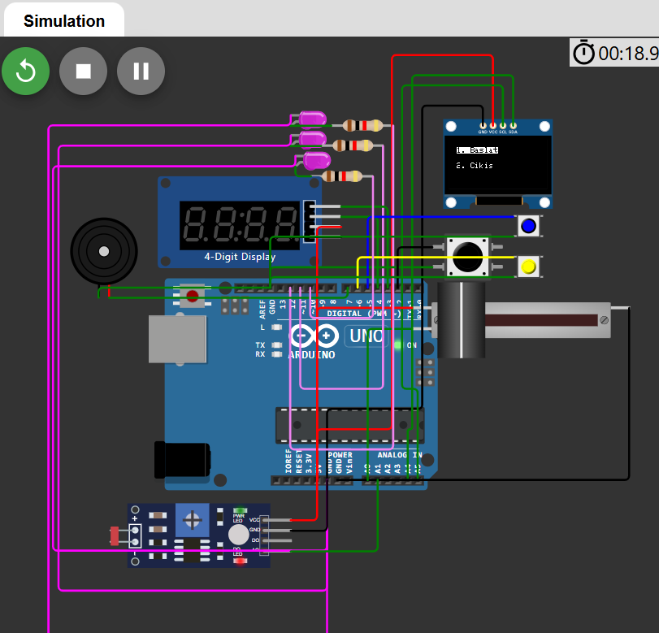
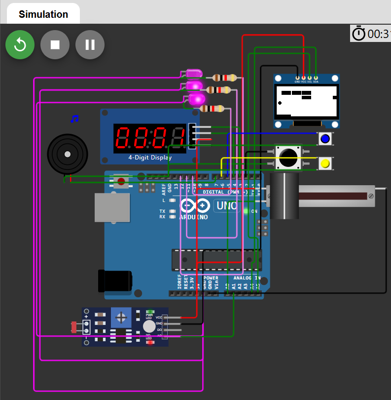
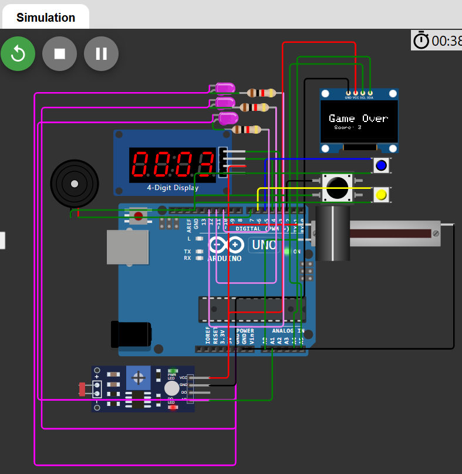

# Microcontroller-Based Game Machine

## Overview
This project aims to develop a microcontroller-based game machine where players control a paddle to reflect a ball and break bricks displayed on an OLED screen. Using a physical potentiometer-based paddle control, players gain points when the ball hits the bricks. The project includes features such as:

- Scoring display using a 7-segment display
- Lives indicator through LEDs
- Dynamic color changes for bricks and background based on a light sensor
- Increased ball speed as levels progress

The game begins with the player selecting either to start or exit the game. Once started, the player controls the paddle via a potentiometer, reflects the ball to break bricks, and gains points for every brick hit. The game ends when the player loses all lives, displaying the final score before returning to the main menu. With increasing ball speed for higher levels, the project provides a progressively challenging and engaging gameplay experience.

This README details the project's purpose, technologies used, components, methods, and results.

## Table of Contents
- [Overview](#overview)
- [Introduction](#introduction)
- [Technologies Used](#technologies-used)
- [Hardware Components](#hardware-components)
- [Software Libraries](#software-libraries)
- [Methodology](#methodology)
- [Functions](#functions)
- [Pseudocode](#pseudocode)
- [Results](#results)
- [Screenshots](#screenshots)
- [References](#references)

## Introduction
Microcontrollers and embedded systems have become crucial in various industries and everyday applications due to their flexibility and programmability. This project demonstrates the capabilities of microcontrollers through the design and implementation of a microcontroller-based game machine. 

By integrating sensors, actuators, and visual displays, this project showcases how microcontrollers can create interactive and engaging systems, especially for educational and hobbyist purposes. This report details each step of the development process, from the hardware setup to software integration.

The primary goal of this project is to help individuals, whether experienced or new to microcontrollers, explore their potential and apply them in real-world scenarios. It also serves as a foundation for future improvements and extensions, such as additional gameplay features and enhanced visual effects.

## Technologies Used
- **Microcontroller:** Arduino UNO
- **Simulation Software:** Wokwi
- **Development Environment:** Arduino IDE
- **Communication Protocols:** SPI and I2C

## Hardware Components
1. **Arduino UNO:** Serves as the central microcontroller unit, processing inputs and controlling outputs.
2. **OLED Screen:** Displays the game interface and visuals, connected via I2C protocol.
3. **Potentiometer:** Allows the player to control the paddle's horizontal movement.
4. **Buttons:** Two buttons are used to start and exit the game.
5. **7-Segment Display:** Displays the player’s score.
6. **Buzzer:** Provides audio feedback during gameplay events.
7. **LED Indicators:** Show the player’s remaining lives.
8. **Light Sensor:** Dynamically adjusts the game’s background and brick colors based on ambient light conditions.
9. **Resistors and Breadboard:** Used to ensure proper connections and functionality.

## Software Libraries
1. **SPI:** Enables OLED screen communication using the SPI protocol.
2. **Wire:** Handles I2C communication for the OLED screen and 7-segment display.
3. **Adafruit_GFX:** Provides graphics functions for drawing shapes and text on the OLED screen.
4. **Adafruit_SSD1306:** Specifically for controlling SSD1306 OLED screens.
5. **TM1637:** Controls the 7-segment display for score representation.

## Methodology
### Hardware Setup
1. **Component Connections:**
   - OLED screen connected to SDA (A4) and SCL (A5) pins.
   - Potentiometer connected to A0 for paddle control.
   - Buttons connected to digital pins for game control.
   - LEDs connected to digital pins for life indicators.
   - Light sensor connected to an analog pin for detecting ambient light.
   - 7-segment display connected to SDA (A4) and SCL (A5).

2. **Testing Connections:**
   Each component was tested independently to ensure proper functionality before integration.

### Software Development
1. **Wokwi Simulation:**
   - Developed and tested the circuit virtually on the Wokwi platform.
   - Simulated components including the OLED screen, potentiometer, buttons, and sensors.

2. **Coding:**
   - Implemented key functions like paddle control, collision detection, and score tracking.
   - Used libraries for OLED and 7-segment display control.

3. **Testing and Debugging:**
   - Tested gameplay features such as ball movement, collision physics, and level transitions.
   - Debugged any issues with hardware-software integration.

## Functions
### Core Functions
1. **`setup()`**: Initializes all components and prepares the game environment.
2. **`loop()`**: The main game loop handling game logic, input, and output.
3. **`displayMainMenu()`**: Displays the main menu options on the OLED screen.
4. **`startGame()`**: Resets game variables and starts gameplay.
5. **`movePaddle()`**: Updates paddle position based on potentiometer input.
6. **`moveBall()`**: Updates the ball’s position and checks for boundary collisions.
7. **`checkCollisions()`**: Detects and handles collisions with bricks, paddle, and walls.
8. **`advanceLevel()`**: Increases the game’s difficulty by speeding up the ball.
9. **`gameOver()`**: Displays the final score and resets the game.

### Utility Functions
1. **`updateLivesDisplay()`**: Updates the LED indicators for remaining lives.
2. **`readLightSensor()`**: Reads light sensor data and adjusts game visuals accordingly.
3. **`createRandomBricks()`**: Generates a random brick layout for each level.
4. **`displayGame()`**: Renders the current game state on the OLED screen.

## Pseudocode
```
StartGame():
    Initialize variables and components
    While game is active:
        Read paddle input
        Update ball position
        Check collisions
        If all bricks are broken:
            Advance to next level
        If lives == 0:
            Display Game Over screen
            Break loop
``` 

## Results
### Observations
1. **Gameplay Mechanics:**
   - Paddle movement was smooth and responsive.
   - Ball physics behaved accurately upon collisions.

2. **Light Sensor Integration:**
   - Successfully changed background and brick colors based on ambient light.

3. **Score Display:**
   - The 7-segment display updated correctly as the player scored points.

4. **LED Indicators:**
   - Reduced LED count accurately represented remaining lives.

### Achievements
- Created a fully functional microcontroller-based game machine.
- Integrated multiple sensors and outputs for an engaging user experience.

## Screenshots
### Main Menu


### Game in Progress


### Game Over Screen


## References
- [Wokwi Platform](https://wokwi.com/)
- [Arduino Game Development Guide](https://projecthub.arduino.cc/)
- [Adafruit OLED Library Documentation](https://learn.adafruit.com/adafruit-gfx-graphics-library/overview)
